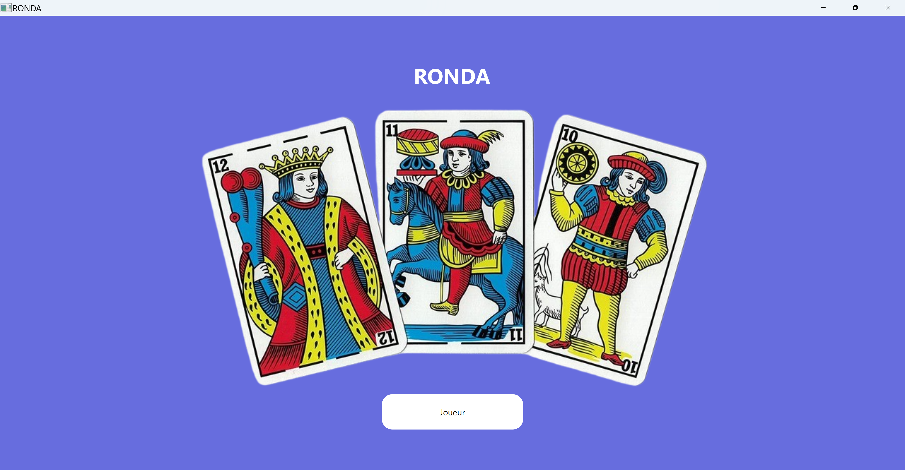
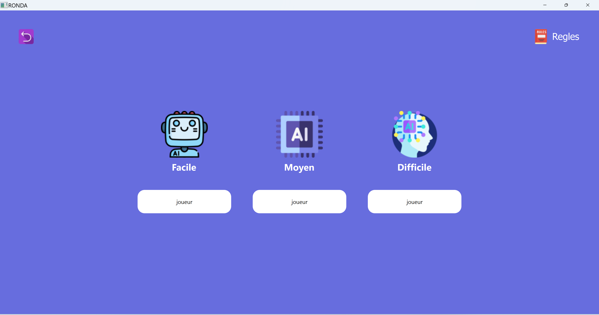
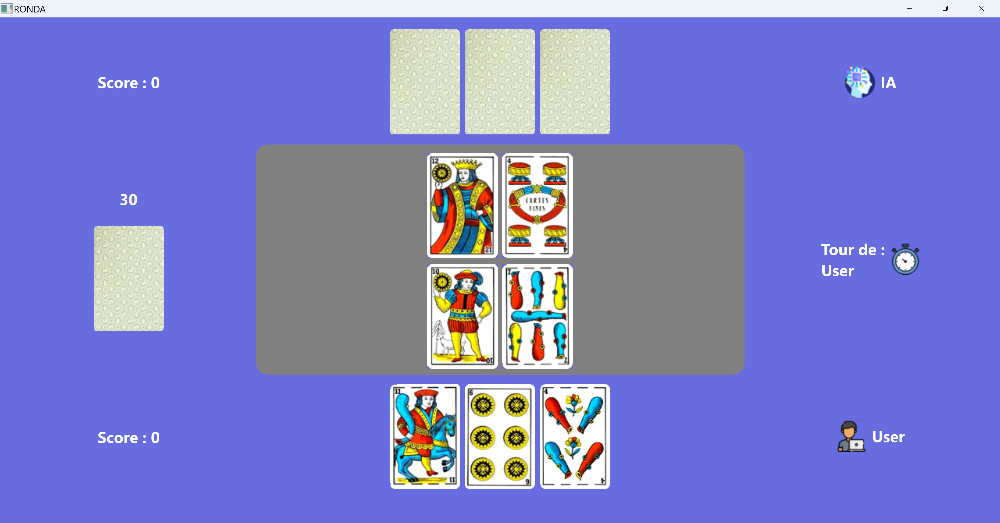

# RONDA - Jeu de Cartes Marocain

RONDA est un jeu de cartes marocain qui utilise une liste de 40 cartes.

## Description du Jeu

Au début de la partie, 3 cartes sont distribuées à l'utilisateur et à l'IA, tandis que 4 cartes sont déposées au milieu de la table. L'objectif du jeu est de collecter toutes les cartes ayant le même numéro ou des numéros consécutifs à l'une de nos cartes.

### Comment Jouer

Pour jouer, il suffit de cliquer sur la carte qui a un numéro appartenant à la liste des numéros des cartes sur la table de jeu. Cette carte et toutes les cartes de numéros consécutifs seront sélectionnées et comptabilisées en points (chaque carte vaut 1 point).

### Fin de la Partie

Le gagnant du jeu est celui des joueurs qui a le plus de points à la fin de la partie.

## Captures d'écran

## Comment Installer

Il suffit de télécharger le Repository et de cliquer sur RONDA.exe ou ouvrir le dossier code source du jeu/RONDA et charger le fichier CMakeLists.txt sur QT. 

## Realiser par 
### CHARRAJ Zakariaa
 - OOP
 - Doc de ce Projet

### KAMATE Boba fousseiny
 - FrontEnd de ce Projet

